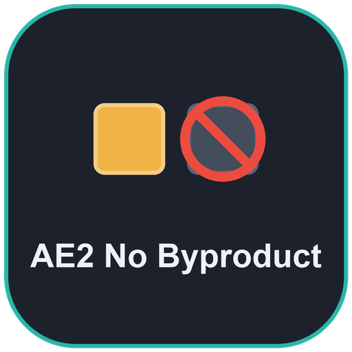

<p align="center">
  
</p>

<h1 align="center">AE2 No Byproduct</h1>

<p align="center">
  <em>Strip autocrafting byproducts from AE2 processing patterns — an in-terminal toggle, a server/pack config, and a tool to clean patterns you already encoded.</em>
</p>

---

## What It Does

Applied Energistics 2 lets you encode **processing patterns** with multiple output slots. Many recipes — smelting, chemical reactions, ore processing chains — produce a primary output and one or more secondary outputs ("byproducts"). In some modpacks those byproduct slots cause ME autocrafting to stall because AE2 cannot route every output to a valid destination.

**AE2 No Byproduct** solves this cleanly at the source: it adds a small toggle button to the AE2 Pattern Encoding Terminal. When the toggle is **ON**, encoding a processing pattern keeps only the **first output** and silently discards every other output before the pattern is saved. Your crafting network no longer needs to handle byproducts it can't route.

Already have patterns encoded with byproducts? The mod also includes a **Byproduct Remover** tool — right-click a Pattern Provider to clean every processing pattern stored inside it at once.

---

## Features

- **Per-player toggle** — a single button in AE2's native left-hand toolbar (green check = ON / red cross = OFF). Each player controls their own preference; it is not a global switch.
- **Server-authoritative** — stripping happens on the server at encode time. There is no client-side bypass.
- **Persistent** — the setting is remembered across relog, server restart, and death.
- **Processing patterns only** — crafting, smithing, and stonecutting patterns (which only have one output anyway) are never affected.
- **Works with AE2 add-ons** — any terminal that reuses AE2's Pattern Encoding Terminal (e.g. wireless pattern terminals) picks up the toggle automatically. No conflicts with other AE2 add-ons.
- **Operator control** — a small server config lets pack makers force-enable stripping for all players with no per-player UI (see [Configuration](#configuration)).
- **Byproduct Remover tool** — a craftable item for cleaning patterns you *already* encoded: right-click a Pattern Provider and every processing pattern inside it is stripped of byproducts in one go.

---

## Requirements & Supported Versions

**Available now**

| Component | Version |
|-----------|---------|
| Minecraft | 1.20.1 |
| Mod loader | Forge 47.x |
| Applied Energistics 2 | 15.4.x |
| Java | 17 (toolchain auto-provisioned by Gradle) |

> AE2 itself depends on GuideME. If you already have AE2 installed, GuideME is already present — no additional action needed.

**Planned (not yet released)**

- 1.20.1 Fabric
- 1.21.1 NeoForge
- 1.21.1 Fabric

Multi-loader and multi-version support is on the roadmap and will be built from a single codebase using Architectury + Stonecutter. Watch the repository for releases.

---

## Installation

1. Download the latest release jar from the [Releases](https://github.com/MrErikCodes/AE2NoByProduct/releases) page.
2. Drop the jar into your `mods/` folder alongside Applied Energistics 2.
3. Launch Minecraft. No extra setup required.

That's it — the toggle button will appear in the Pattern Encoding Terminal as soon as the mod is loaded.

---

## Usage

### The toggle button

1. **Open the Pattern Encoding Terminal** as you normally would.
2. **Find the toggle button** in AE2's left-hand toolbar (the same column as other AE2 toolbar buttons, such as the crafting mode selector). The button shows a **red cross** by default (stripping is OFF).
3. **Click the button** to enable stripping. It switches to a **green check** (ON).
4. **Encode a processing pattern** with multiple output slots. When you click "Encode", only the first output is saved into the pattern; all other outputs are discarded.
5. Click again to return to the **red cross** (OFF) — patterns encoded while OFF keep all their outputs as usual.

Your choice is saved automatically. You can close and reopen the terminal, relog, or restart the server — your setting persists.

> **Note:** The toggle has no effect on crafting patterns, smithing patterns, or stonecutting patterns, since those only ever produce one output anyway.

### The Byproduct Remover tool

For patterns that were *already* encoded with byproducts, craft the **Byproduct Remover** — a shapeless recipe of a **16k Storage Component** + a **Blank Pattern** + a **Crafting Unit**. **Shift + right-click a Pattern Provider** with it and every processing pattern stored in that provider is re-encoded to keep only its first output. A chat message reports how many patterns were cleaned (this can be silenced — see `showMessages` below). The tool is reusable by default.

---

## Configuration

The server config is written to `<world>/serverconfig/ae2nobyproduct-server.toml` (Forge per-world server config). It is created automatically on first launch with defaults.

| Option | Default | Description |
|--------|---------|-------------|
| `enableFeature` | `true` | Master switch. When `false`, the mod is completely inactive — no button is shown and no stripping occurs. |
| `allowPlayerToggle` | `true` | When `true`, each player sees the toggle button and controls their own preference. When `false`, the button is hidden and `defaultStrip` is applied to everyone with no exceptions. |
| `defaultStrip` | `false` | The starting value for players who have never toggled the button. Also the forced value for all players when `allowPlayerToggle = false`. |
| `consumeOnUse` | `false` | When `true`, the Byproduct Remover item is consumed (one is used up) each time it successfully cleans at least one pattern. Default keeps it a reusable tool. |
| `showMessages` | `true` | When `true`, the Byproduct Remover sends a chat message after use. Set to `false` to silence it. |

**Pack-maker tip: force stripping for all players**

To make byproduct stripping always-on with no player choice — useful when you want every autocrafting pattern in the pack to be byproduct-free — set:

```toml
allowPlayerToggle = false
defaultStrip = true
```

No button will appear in the terminal; all processing patterns will silently strip byproducts for every player.

---

## Building from Source

Java 17 is required. The Gradle wrapper provisions a JDK 17 toolchain automatically if one is not found locally.

```bash
git clone https://github.com/MrErikCodes/AE2NoByProduct.git
cd AE2NoByProduct
./gradlew build
```

The output jar will be in `build/libs/`.

To launch a dev client for in-game testing:

```bash
./gradlew runClient
```

See [CONTRIBUTING.md](CONTRIBUTING.md) for full dev environment setup instructions.

---

## Contributing

Contributions are welcome! Please read [CONTRIBUTING.md](CONTRIBUTING.md) before opening a pull request — it covers the dev environment, project layout, coding conventions, and the PR process.

**Found a bug?** Open an issue using the [Bug Report](.github/ISSUE_TEMPLATE/bug_report.yml) template. Include your Minecraft version, mod loader version, AE2 version, AE2 No Byproduct version, logs, and clear reproduction steps.

**Have a question?** Use [GitHub Discussions](https://github.com/MrErikCodes/AE2NoByProduct/discussions) rather than an issue.

---

## License

This project is licensed under the **MIT License** — see [LICENSE](LICENSE) for the full text.

---

## Credits

[Applied Energistics 2](https://github.com/AppliedEnergistics/Applied-Energistics-2) is the foundation this mod builds on. All AE2 trademarks and assets belong to their respective owners. AE2 No Byproduct is an independent add-on and is not affiliated with or endorsed by the AE2 team.
